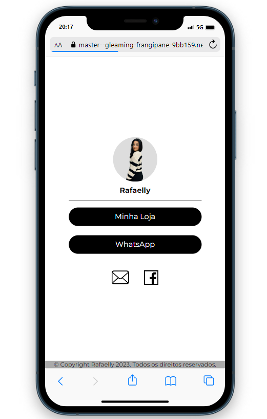

<h1 align="center">Linktree 📸</h1>

> O sistema é uma página personalizada projetada para ser utilizada como link na biografia do Instagram.

<p align="center">
  
</p>


Confira a aplicação: https://cutt.ly/rafaelly_anascimento

## :page_facing_up: Explicação

O projeto descreve uma plataforma inspirada no conceito do Linktree do Instagram, que proporciona aos usuários ter uma única página personalizada com vários links para suas redes sociais, portfólio, blog e outros conteúdos online.

Essa ferramenta foi desenvolvida com o objetivo de simplificar e otimizar a forma como os usuários compartilham múltiplos links em suas redes sociais, facilitando o acesso a todas as suas informações importantes a partir de um único URL.

## :dart: Passos

:heavy_check_mark: Criação dos elementos na tela;\
:heavy_check_mark: Definição de layout e cores;\
:heavy_check_mark: Estilização;\
:heavy_check_mark: Responsividade;\
:heavy_check_mark: Melhorias na experiência do usuário;

## :rocket: Tecnologias

As seguintes ferramentas foram utilizadas neste projeto:

- [HTML](https://developer.mozilla.org/en-US/docs/Web/HTML)
- [CSS](https://developer.mozilla.org/en-US/docs/Web/CSS)
- [Flex Box](https://origamid.com/projetos/flexbox-guia-completo/)
- [UI e UX](https://www.venturus.org.br/blog/diferenca-entre-ui-e-ux/)

## :closed_book: Requisitos ##

Antes de começar, você precisa ter [Git](https://git-scm.com) e [Node](https://nodejs.org/en/) instalados em seu computador.

## :checkered_flag: Getting Started ##

```bash
# Clone o projeto
$ git clone https://github.com/Dev-LucasM/linktree
# Accesso
$ cd linktree
# Rodando o projeto
$ Rode ele com o Live Server
```
## 🤝 Contribuidores

Queremos agradecer às seguintes pessoas que contribuíram para este projeto:

<table>
  <tr>
    <td align="center">
      <a href="#">
        <br>
        <sub>
          <b>Lucas Maurício</b>
        </sub>
      </a>
    </td>
  </tr>
</table>
